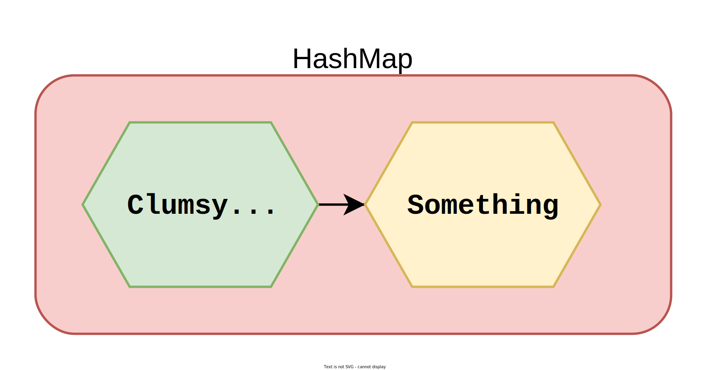

# blazemap

_Provides a wrapper for replacing a small number of clumsy objects with identifiers, and also implements a vector-based
slab-like map with an interface similar to that of `HashMap`._

Let's imagine that at runtime you create a small number of clumsy objects that are used as keys in hashmaps.

This crate allows you to seamlessly replace them with lightweight identifiers in a slab-like manner
using the `register_blazemap_id_wrapper` macro as well as using them as keys in
the `BlazeMap`
— a vector-based slab-like map with an interface similar to that of `HashMap`.

You can also use the `register_blazemap_id` macro if you want to create a new type based on `usize`
that is generated incrementally to use as such a key.

# No-brain vs `blazemap` approach

The logic behind the `register_blazemap_id_wrapper` macro is shown below.

## Standard no-brain approach



```rust
let clumsy  = MassiveStruct::new();
let mut map = HashMap::new();
map.insert(clumsy, "clumsy")     // Too inefficient
```

## `blazemap` approach

```rust
use blazemap::prelude::{BlazeMap, register_blazemap_id_wrapper};

register_blazemap_id_wrapper! {
    struct Id(MassiveStruct)
}

let clumsy    = MassiveStruct::new();
let clumsy_id = Id::new(clumsy);

let mut map   = BlazeMap::new();
map.insert(clumsy_id, "clumsy")  // Very efficient
```



# Type-generating macros

## `register_blazemap_id_wrapper`

Creates a new type that acts as an `usize`-based replacement for the old type
that can be used as a key for `blazemap` collections.

This macro supports optional inference of standard traits using the following syntax:

* `Derive(as for Original Type)` — derives traits as for the original type
  for which `blazemap` ID is being registered. Each call to methods on these traits
  requires an additional `.read` call on the internal synchronization primitive,
  so — all other things being equal — their calls may be less optimal
  than the corresponding calls on instances of the original key's type.
  This method supports inference of the following traits:
    * `Default`
    * `PartialOrd` (mutually exclusive with `Ord`)
    * `Ord` (also derives `PartialOrd`, so mutually exclusive with `PartialOrd`)
    * `Debug`
    * `Display`
    * `Serialize` (with `serde` feature only)
    * `Deserialize` (with `serde` feature only)
* `Derive(as for Serial Number)` — derives traits in the same way as for
  the serial number assigned when registering an instance of the original type
  the first time [`IdWrapper::new`](crate::prelude::KeyWrapper::new) was called.
  Because methods inferred by this option do not require additional
  locking on synchronization primitives,
  they do not incur any additional overhead compared to methods inferred for plain `usize`.
  This method supports inference of the following traits:
    * `PartialOrd` (mutually exclusive with `Ord`)
    * `Ord` (also derives `PartialOrd`, so mutually exclusive with `PartialOrd`)

### Example

```rust
use blazemap::prelude::{BlazeMap, register_blazemap_id_wrapper};

register_blazemap_id_wrapper! {
    pub struct Key(String);
    Derive(as for Original Type): {  // Optional section
        Debug,
        Display,
    };
    Derive(as for Serial Number): {  // Optional section
        Ord,
    }
}

let key_1 = Key::new("first".to_string());
let key_2 = Key::new("second".to_string());
let key_3 = Key::new("third".to_string());

let mut map = BlazeMap::new();
map.insert(key_2, "2");
map.insert(key_1, "1");
map.insert(key_3, "3");

assert_eq!(format!("{map:?}"), r#"{"first": "1", "second": "2", "third": "3"}"#)
```

## `register_blazemap_id`

Creates a new type based on incrementally generated `usize` instances
that can be used as a key for `blazemap` collections.

This macro supports optional inference of standard traits using the following syntax:

* `Derive` — derives traits in the same way as for
  the serial number assigned when creating a new instance of the type.
  Because methods inferred by this option do not require additional
  locking on synchronization primitives,
  they do not incur any additional overhead compared to methods inferred for plain `usize`.
  This method supports inference of the following traits:
    * `PartialOrd` (mutually exclusive with `Ord`)
    * `Ord` (also derives `PartialOrd`, so mutually exclusive with `PartialOrd`)
    * `Serialize` (with `serde` feature only)

### Example

```rust
use blazemap::prelude::{BlazeMap, register_blazemap_id};

register_blazemap_id! {
    pub struct Id(start from: 1);  // "(start from: number)" is optional
    Derive: {                      // Derive section is also optional
        Ord
    };
}

let key_1 = Id::new();
let key_2 = Id::new();
let key_3 = Id::new();

let mut map = BlazeMap::new();
map.insert(key_2, "2");
map.insert(key_1, "1");
map.insert(key_3, "3");

assert_eq!(format!("{map:?}"), r#"{1: "1", 2: "2", 3: "3"}"#)
```